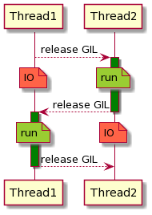

# Extending Cython With GIL-free Types

<p>
  
  
  
  
</p>

---

<!-- .slide: style="font-size: 32px;" -->

|                                | Past    | Present | Future  |
| ------------------------------ | ------- | ------- | ------  |
| **ERP5 / SlapOS / Wendelin**   | Python | Python  | <span style="color:green">Cython+</span > |
| **Instagram**                  | Python  | Python  | Python  |
| **Dropbox**                    | Python  | Go      | Go      |
| **OpenSVC**                    | Python  | Python  | Go      |
| **CleverCloud**                |         | Rust    | Rust    |
| **Kubernetes**                 |         | Go      | Go      |
| **Scikit-learn**               | Cython  | Cython  | <span style="color:green">Cython</span > | |

---

## What is Cython ?

----

<!-- .slide: data-transition="slide-in zoom-out" -->

```python
a = 2
b = 3
c = a + b
```

----

<!-- .slide: data-transition="zoom-in slide-out" -->

```c
PyObject * a, b, c;
a = PyInt_FromLong(2);
b = PyInt_FromLong(3);
c = PyNumber_Add(a, b);
```

----

<!-- .slide: data-transition="slide-in zoom-out" -->

```python
cdef int a, b, c
```

----

<!-- .slide: data-transition="zoom-in zoom-out" -->

```python
cdef int a, b, c
a = 2
b = 3
c = a + b
```

----

<!-- .slide: data-transition="zoom-in slide-out" -->

```c
int a, b, c;
a = 2;
b = 3;
c = (a + b);
```

----

<!-- .slide: data-transition="slide-in zoom-out" -->

```python
from libc.stdio cimport printf
printf("Hello World !\n")
```

----

<!-- .slide: data-transition="zoom-in zoom-out" -->

```c
#include <stdio.h>
printf((char const *)"Hello World !\n");
```

----

<!-- .slide: data-transition="zoom-in slide-out" -->

```python-repl
>>> import helloworld
Hello Word !
>>>
```

---

## Bypassing the GIL with Cython

----



----

```c
typedef struct _object {
    _PyObject_HEAD_EXTRA
    Py_ssize_t ob_refcnt;
    PyTypeObject *ob_type;
} PyObject;
```

----

<!-- .slide: data-transition="slide-in zoom-out" -->

```python
with nogil:
    # the GIL is released here
```

----

<!-- .slide: data-transition="zoom-in zoom-out" -->

```python
with nogil:
    # ERROR!
    a = 2
    b = 3
    c = a + b
```

----

<!-- .slide: data-transition="zoom-in zoom-out" -->

```python
cdef int a, b, c
with nogil:
    # OK
    a = 2
    b = 3
    c = a + b
```

----

<!-- .slide: data-transition="zoom-in zoom-out" -->

```python
with nogil:
    # ERROR!
    l = [1, 2]
    l.append(3)
```

----

<!-- .slide: data-transition="zoom-in zoom-out" -->

```python
cdef int l[3]

with nogil:
    # OK
    l[0] = 1
    l[1] = 2
    l[2] = 3
```

----

<!-- .slide: data-transition="zoom-in zoom-out" -->

```python
with nogil:
    # ERROR!
    with open('somefile') as f:
        f.read()
```

----

<!-- .slide: data-transition="zoom-in zoom-out" -->

```python
from libc.stdio cimport fopen, fclose, fread, FILE

cdef unsigned char buf[1024]
cdef FILE * f
cdef int size

with nogil:
    # OK
    f = fopen('somefile.txt', 'r')
    size = fread(buf, 1, 1024, f)
    fclose(f)
```

----

<!-- .slide: style="font-size: 32px;" -->

|            | Object Oriented | Memory Managed | Thread-Safe | Fast    | Multi-Core |
| ---------- | --------------- | -------------- | ----------- | ------- | ---------- |
| `PyObject` | yes             | yes            | yes         | no      | no         |
| `C`        | no              | no             | no          | yes     | yes        |
| `C++`      | yes             | no             | no          | yes     | yes        |

---

## Let's hack a bit in the Cython compiler

----

<!-- .slide: data-transition="slide-in zoom-out" -->

```python
cdef cypclass Adder:
    int value

    __init__(self, int value):
        self.value = value

    int add(self, int v):
        self.value += v
        return self.value
```

----

<!-- .slide: data-transition="zoom-in zoom-out" -->

```cpp
struct CyObject {
    std::atomic_int nogil_ob_refcnt;
    /* ... */
};

struct Adder : CyObject {
    int value;
    void __init__(int);
    int add(int);
    /* ... */
};
```

----

<!-- .slide: data-transition="zoom-in slide-out" -->

```python
with nogil:
    a = Adder(1)
```

---

## Making `CyObject` Python-compatible

----

```python-repl
>>> from snakes import Adder
>>> a = Adder(2)
>>> repr(a)
'<snakes.Adder object at 0x2940c98>'
>>> a.value
2
>>> a.add(3)
5
>>>
```

----

```cpp
typedef struct _object {
    Py_ssize_t ob_refcnt;
    /* ... */
} PyObject;

struct CyObject : PyObject {
    std::atomic_int nogil_ob_refcnt;
    /* ... */
};
```

----

```cpp
void tp_dealloc_Adder(PyObject *o) {
    /* A normal PyObject would free the memory here */
    CyObject * c = static_cast<CyObject *>(o);
    Cy_DECREF(c);
}
```

---

## Making `CyObject` thread-safe

----

### Reference Capabilities

Castegren, E. (2018).
Capability-Based Type Systems for Concurrency Control.

----

<!-- .slide: style="font-size: 32px;" -->

| Object State   | Type System Guarantee                  |
| -------------- | -------------------------------------- |
| *thread-local* | all references live in the same thread |
| *immutable*    | all references can only read           |
| *locked*       | all references share a lock            |
| *active*       | all references share a message queue   |
| *isolated*     | only reachable through one reference   |

----

<!-- .slide: data-transition="slide-in zoom-out" -->

```python
a = Adder(1) # thread-local

# a cannot be shared
# with another thread
```

----

<!-- .slide: data-transition="zoom-in zoom-out" -->

```python
a = Adder(1) # thread-local

# ERROR!
cdef lock Adder b = a

# an object cannot be seen as
# thread-local and locked
# at the same time
```

----

<!-- .slide: data-transition="zoom-in slide-out" -->

```python
a = Adder(1) # thread-local

# OK if a is isolated
cdef lock Adder b = consume a

# a is now out of scope
# b can be safely shared with other threads
```

----

|               | Performance        | Productivity       |
| ------------- | ------------------ | ------------------ |
| Single-Thread | zero overhead      | zero headache      |
| Multi-Thread  | minimal cost       | no weird bugs      |

---

<!-- .slide: style="font-size: 32px;" -->

|            | Object Oriented | Memory Managed | Thread-Safe | Fast    | Multi-Core |
| ---------- | --------------- | -------------- | ----------- | ------- | ---------- |
| `PyObject` | yes             | yes            | yes         | no      | no         |
| `C`        | no              | no             | no          | yes     | yes        |
| `C++`      | yes             | no             | no          | yes     | yes        |
| `CyObject` | **yes**         | **yes**       | **yes**     | **yes** | **yes**    |

---


---

<!-- .slide: style="font-size: 32px;" -->

## Thank You !

- Gwenaël Samain
- Boxiang Sun
- Bryton Lacquement
- Julien Muchembled
- Stéphane Fermigier
- Gaël Varoquaux
- Gilles Polart-Donat
- Julien Jerphanion
- Olivier Grisel
- François Gagnard
- Xiaowu Zhang
- Thomas Gambier

<p>
  
  
  
</p>

---

## Questions ?

More at https://cython.plus

